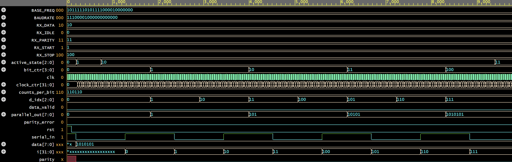

# Evidencia 2 - Parte 1  
## Comunicación serial asincrónica RS-232 y diseño de UART

---

## 📘 Introducción

Esta evidencia tiene como objetivo el diseño de un sistema UART basado en el estándar RS-232 mediante una máquina de estados finitos (FSM) implementada en VHDL. Se busca comprender el funcionamiento de los transmisores y receptores asíncronos, los cuales permiten enviar y recibir datos de forma serial, utilizando bits de inicio, paridad y parada como métodos de sincronización y verificación.

---

## 📌 Descripción del problema

El desafío consiste en implementar un sistema de transmisión y recepción de datos compatible con el estándar RS-232. Este protocolo transmite datos de 7 u 8 bits con detección de errores por paridad. Para lograr esto, es necesario comprender e implementar un UART que funcione correctamente a nivel digital, manejando tanto los estados del transmisor como del receptor.

---

## 🧠 Desarrollo de la propuesta de solución

**Lenguaje:**  
- VHDL  

**Herramientas utilizadas:**  
- ModelSim / QuestaSim  
- EDAPlayground (https://edaplayground.com/)  

**Arquitectura:**  
- Máquina de Estados Finitos (FSM) para transmisor  
- Máquina de Estados Finitos (FSM) para receptor  

---

### 🚀 FSM del Transmisor UART (TX)

Este módulo se encarga de enviar datos en serie, paso por paso, usando los siguientes estados:

- `TX_IDLE`: Espera a que se active la transmisión (`tx_start = 1`)
- `TX_START`: Manda un bit de inicio (0 lógico)
- `TX_DATA`: Envía uno por uno los 8 bits del dato (`data_in`)
- `TX_PARITY`: Calcula y envía el bit de paridad (sirve para detectar errores)
- `TX_STOP`: Manda el bit de parada (1 lógico) para cerrar la transmisión

👉 Al finalizar la transmisión, la señal `tx_done` se pone en alto.

---

### 📥 FSM del Receptor UART (RX)

Este módulo escucha continuamente el pin `rx` esperando recibir datos. Sus estados son:

- `RX_IDLE`: Espera que llegue un 0 (bit de inicio)
- `RX_START`: Confirma que ese 0 es válido
- `RX_DATA`: Lee los 8 bits del dato recibido
- `RX_PARITY`: Verifica si el bit de paridad coincide
- `RX_STOP`: Comprueba si el bit final es un 1 (parada correcta)

👉 Cuando se completa la recepción, el dato se entrega por `data_out` y se activa la señal `rx_done`.

---

## 🧪 Simulaciones

Las simulaciones validan lo siguiente:

- La transmisión de un byte con sus bits de control correctamente ordenados.
- La recepción completa del dato transmitido sin errores.
- La correcta sincronización entre transmisor y receptor bajo condiciones ideales.

**Testbenches incluidos:**

- `uart_tx_tb.v` → Prueba del transmisor
  
  **Simulación de Tx**
  
  

  En la gráfica de simulación se observa que la transmisión UART se lleva a cabo correctamente. El módulo inicia la transmisión de tres datos secuenciales (0x55, 0xAA y 0x3C) mediante la señal `send_data`. Esta señal se activa brevemente para indicar que un nuevo byte debe ser enviado. Después, se mantiene en alto durante un ciclo de reloj. Esto es adecuado para iniciar el proceso de transmisión sin generar múltiples envíos por un mismo dato.
  
  El dato a transmitir (data[7:0]) se actualiza correctamente antes de cada envío. Se puede verificar que el valor de salida `serial_out` cambia de acuerdo con la trama UART correspondiente para cada byte. Las tramas incluyen el bit de inicio (`start bit`), los ocho bits de datos, el bit de paridad (impar en este caso), y el bit de parada (`stop bit`).

  El comportamiento interno del módulo también es coherente con el proceso de transmisión. El registro active_state muestra la evolución a través de los distintos estados del transmisor, desde reposo (`IDLE`), paso por `START`, `DATA, PARITY`, hasta llegar a `STOP`. Las señales auxiliares como `bit_ctr` y `d_idx` también reflejan el avance por cada bit del dato y la temporización interna por bit, respectivamente.

  Finalmente, la señal `serial_out` presenta las transiciones esperadas. Por ejemplo, para el primer dato enviado (0x55, patrón binario 01010101), se observa una oscilación coherente con los bits de datos, además del bit de paridad correcto y el correspondiente bit de parada, lo cual confirma visualmente que la transmisión es precisa.

- `uart_rx_tb.v` → Prueba del receptor  

   **Simulación de Rx**

   

   En la gráfica de simulación se observa que la **recepción UART** se lleva a cabo correctamente. El módulo inicia en estado de reposo (`RX_IDLE = 1`) mientras espera la llegada de un bit de inicio. Al detectarse una transición baja en la señal `serial_in`, el receptor comienza el proceso de captura de datos.

   El dato recibido (`data[7:0]`) se va reconstruyendo bit a bit conforme avanza la recepción. El valor final capturado es `0x55` (01010101), el cual se refleja correctamente en la señal `parallel_out`. Al concluir la recepción del byte, se activa brevemente la señal `data_valid`, indicando que el dato es válido y puede ser procesado por la lógica posterior.

   El comportamiento interno del módulo es coherente con una recepción bien secuenciada. La señal `active_state` muestra la evolución a través de los distintos estados de la máquina receptora: desde reposo (`IDLE`), paso por `START`, captura de datos (`DATA`), verificación de paridad (`PARITY`) y finalización en `STOP`. Las señales auxiliares como `bit_ctr` y `d_idx` permiten observar el avance por cada bit recibido y su sincronización interna por reloj.

   Además, el bit de paridad también es recibido y evaluado correctamente (`parity = 1`), sin detectarse errores (`parity_error = 0`). Esto confirma que la verificación de integridad está funcionando como se espera. La señal `serial_in` presenta las transiciones esperadas durante todo el proceso, desde el bit de inicio hasta el bit de parada, validando visualmente la correcta decodificación de la trama UART.

- `uart_top_tb.v` → Prueba del sistema completo

   **Simulación de TOP**
  
  En la gráfica de simulación se observa el comportamiento correcto del sistema UART en modo transmisión, gestionado desde el módulo top_tb. Al inicio, el sistema se mantiene en estado de reposo (send_data = 0) y con rst desactivado, permitiendo que la lógica FSM permanezca estable y sincronizada al reloj (clk).

  Cuando se activa la señal send_data, el sistema interpreta que hay un nuevo dato disponible para ser transmitido. Esto coincide con la señal data_valid = 1, la cual indica que el dato en el bus data[7:0] es válido —en este caso el valor 0x55 (01010101 en binario).

  La señal parallel_out[7:0] muestra una evolución clara conforme se realiza la transmisión: los valores que aparecen (0x00, 0x1t, 0x55, 0x4a, etc.) representan la transformación progresiva del dato conforme se mueve por las diferentes etapas de transmisión y preparación de la salida serial.

  A lo largo del tiempo de simulación, se puede observar cómo el sistema transmite correctamente una serie de valores. El comportamiento temporal está bien alineado con el reloj del sistema, lo que indica que el diseño mantiene la sincronización correcta de todos los eventos clave.

  El bit de reset (rst) se mantiene brevemente activo al principio y luego se libera, permitiendo que los estados FSM inicien desde una condición conocida y limpia. Esto es crucial para evitar condiciones indeterminadas al comienzo de la simulación.

  En resumen, la gráfica confirma que el UART envía datos de forma secuencial y estable. La combinación de señales send_data, data_valid, y parallel_out demuestra que la arquitectura FSM de transmisión está funcionando de forma ordenada, preparando correctamente los frames UART para su envío en tiempo real.

---

## ✅ Conclusiones

El diseño e implementación inicial del UART permite comprender de manera estructurada la lógica detrás de la transmisión asincrónica de datos. El uso de máquinas de estados facilita una arquitectura clara, escalable y verificable del sistema.

Este ejercicio refuerza la importancia de los UARTs en sistemas embebidos y sienta las bases para una implementación robusta en hardware real.

> *El UART no es solo una herramienta académica, sino un componente esencial en la comunicación digital moderna.*

---

## 📚 Referencias

- Documentación oficial del estándar RS-232  
- Apuntes y material del curso  
- Libros de diseño digital (VHDL y Verilog)  
- Recursos académicos sobre UART y FSMs  

---

## 📎 Apéndice

El código fuente en Verilog se encuentra en los archivos adjuntos:  
`uart_tx.v`  
`uart_rx.v`  
`uart_top.v`

---

## 📂 Archivos incluidos

- `uart_tx.v` → Transmisor UART  
- `uart_rx.v` → Receptor UART  
- `uart_top.v` → Módulo superior que conecta TX y RX  
- `uart_tx_tb.v` → Testbench del transmisor  
- `uart_rx_tb.v` → Testbench del receptor  
- `uart_top_tb.v` → Testbench general

---
